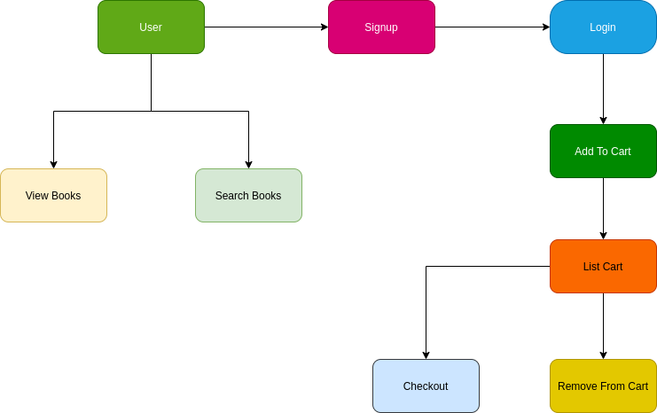

# library-management-golang

Backend system designed to encompass all the features needed for a functioning library.

## Table of Contents
1. [Project Outline](#project-outline)
2. [Features](#features)

## Project Outline

## Features
### Signup
Inorder to checkout books from the system, a user must first signup and then only will be eligible to checkout. The user is not authorized to add new books into the system and that can only be done by the admin. Getting all books, searching for books by title and searching for books by author can all be done without signing up.

## Login
Once the user is logged in, a token for that particular user is generated and saved as a cookie. This token allows for user authentication and validation. On log in, a new cart is created for the user if one doesn't already exist and the user can access features such as adding to cart, getting cart items, removing from cart and checkout functionality.

## Authentication
A user will not be able to access features mentioned in the Login topic if there is no authentication token present in the cookie. The authentication system was made using JSON Web Tokens (JWT). For accessing any feature, the user information is retrieved from the token generated with the help of Claims, which inturn gives access to the cart assigned to that particular user.

## Add To Cart
Any book present in the system can be added to a specific user's cart and the quantity of the book will be updated accordingly.

## Remove From Cart
Books can be removed from the cart as easily as they can be added to the cart.

## Checkout
On checkout, a due date is entered for all the books being checked out and further the cart is emptied.
